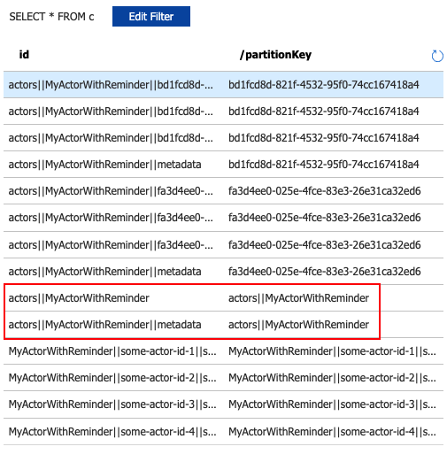

# README
This is a demonstration of the broken reminder partitions in CosmosDB.

## Prerequisites
1. Dotnet 8.0 SDK
2. Dapr CLI v1.13
3. Dapr runtime v1.10.5 (or newer)
4. Dapr placement service (latest)
5. Azure account with CosmosDB NoSQL API resource
  - Ensure the database has a container and it is empty

## Setup
1. Create the actor state store component under src/Application/dapr-components

## Run
Use the start.sh script to run the application. This will start the Dapr runtime and the application. Alternatively you can run the application using the following commands:

```bash
dapr run --app-id demo --app-port 5000 -d src/Application/dapr-components -- dotnet run --project src/Application/Application.csproj
```

This repository can be started as a GitHub Codespace or as a devcontainer in VSCode.

## Explanation of the bug
The bug is demonstrated by the following steps:

1. Start the application.
2. Send a request to the API to create a few actor:
  - http://localhost:5000/some-actor-id-1/start
  - http://localhost:5000/some-actor-id-2/start
  - http://localhost:5000/some-actor-id-3/start
  - http://localhost:5000/some-actor-id-4/start
3. Verify the actor's reminders are requested every 5 seconds.
4. Open CosmosDB explorer in Azure Portal and observe the created data.



**Actual behavior**<br/>
As you will see, the sidecar has created 2 partitionids with 3 partitions each for the actor's reminders. However, the data is stored into the `actors||MyActorWithReminder` document (see JSON below).

**Expected behavior**<br/>
The expected behavior is that there is 1 partitionId created with 3 partitions for the actor's reminders. The reminder data should be stored in those partitions instead of the `actors||MyActorWithReminder` document.

```json
{
    "id": "actors||MyActorWithReminder",
    "value": [
        {
            "registeredTime": "2024-03-13T08:11:49Z",
            "period": "0h0m10s0ms",
            "data": "",
            "actorID": "some-actor-id-1",
            "actorType": "MyActorWithReminder",
            "name": "some-reminder-name",
            "dueTime": "0h0m5s0ms"
        },
        {
            "registeredTime": "2024-03-13T08:11:53Z",
            "period": "0h0m10s0ms",
            "data": "",
            "actorID": "some-actor-id-2",
            "actorType": "MyActorWithReminder",
            "name": "some-reminder-name",
            "dueTime": "0h0m5s0ms"
        },
        {
            "registeredTime": "2024-03-13T08:11:57Z",
            "period": "0h0m10s0ms",
            "data": "",
            "actorID": "some-actor-id-3",
            "actorType": "MyActorWithReminder",
            "name": "some-reminder-name",
            "dueTime": "0h0m5s0ms"
        },
        {
            "registeredTime": "2024-03-13T08:12:00Z",
            "period": "0h0m10s0ms",
            "data": "",
            "actorID": "some-actor-id-4",
            "actorType": "MyActorWithReminder",
            "name": "some-reminder-name",
            "dueTime": "0h0m5s0ms"
        }
    ],
    "isBinary": false,
    "partitionKey": "actors||MyActorWithReminder",
    "Etag": "",
    "_rid": "cRtmAOmU+JedAAAAAAAAAA==",
    "_self": "dbs/cRtmAA==/colls/cRtmAOmU+Jc=/docs/cRtmAOmU+JedAAAAAAAAAA==/",
    "_etag": "\"4c00eece-0000-0d00-0000-65f15fcb0000\"",
    "_attachments": "attachments/",
    "_ts": 1710317515
}
```

5. Stop the application.
6. Clear the CosmosDB container.
7. Uninstall the Dapr runtime.
8. Install the Dapr runtime v1.10.4.
9. Execute the scenario above again and notice the data is stored as expected.

## Conclusion
Storage of actor reminders is broken in CosmosDB when using Dapr runtime v1.10.5. The data is stored in the wrong place and the partitioning is incorrect. This is a regression bug as it worked in Dapr runtime v1.10.4.